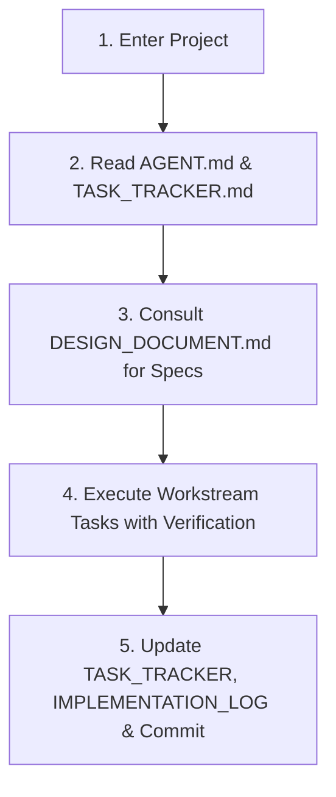

# Obsidian AI Project Vault: Minutiae Tracking & Architecture System

This skill provides a standardized, battle-tested methodology for maintaining project architecture, execution plans, and implementation minutiae using an **Obsidian-compatible Markdown Vault**. It ensures that multiple AI agents and human developers can collaborate asynchronously across time without losing architectural intent, forgetting past decisions, or repeating superseded approaches.

---

## 1. Core Philosophy: The Living Vault as AI External Memory

Large Language Models have finite context windows and start fresh in new sessions. To build complex, high-reliability software without context drift:
1. **The Codebase Reflects the Present; The Vault Reflects the Strategy & History.**
2. **Every Architectural Rule has a Home:** Nothing is left implicit in conversational chat.
3. **Minutiae Must Be Tracked at the Task Level:** High-level roadmaps fail because subtle decisions (e.g., index types, lock modes, timeout values) get lost. Each task must record its own history.
4. **Supersession is Explicit:** When an earlier design or code choice is replaced, it must be documented as *superseded* along with the technical rationale so future AIs do not regress to the older pattern.

---

## 2. Vault Structure & Obsidian Formatting Standards

An AI Obsidian Project Vault is organized either in a dedicated `docs/` folder or root vault:

```text
my-project/
├── AGENT.md                       # AI Agent Operating Directives (Prime Directives)
├── README.md                      # High-Level Project Overview & Vault MOC (Map of Content)
├── docs/
│   ├── DESIGN_DOCUMENT.md         # Pillar 1: Single Source of Truth & Architecture Baseline
│   ├── TASK_TRACKER.md            # Pillar 2: Granular Task Catalog, Statuses & Task History
│   ├── IMPLEMENTATION_LOG.md      # Pillar 3: Chronological Ledger & Component Matrix
│   └── decisions/                 # Pillar 4: Architectural Decision Records (ADRs)
│       ├── ADR-001-initial-baseline.md
│       └── ...
└── .agents/
    └── skills/
        └── obsidian-project-vault/
            └── SKILL.md           # This Skill Definition
```

### Obsidian Compatibility Rules
* **YAML Frontmatter:** Use frontmatter on major docs for Obsidian search and Dataview plugin compatibility:
  ```yaml
  ---
  title: System Design Document
  tags: [architecture, baseline, active]
  version: 1.0.0
  last_updated: 2026-09-02
  status: approved
  ---
  ```
* **Dual Linking:** Use standard GitHub Markdown links with file paths (e.g., `[Design Doc](docs/DESIGN_DOCUMENT.md)`) or Obsidian wikilinks (`[[DESIGN_DOCUMENT]]`) so files render cleanly in GitHub, local IDEs, and Obsidian graph views.
* **Mermaid Flowcharts:** Use Mermaid for state machines, architecture flows, and entity relationships to leverage Obsidian's native visual rendering.
* **Math Blocks:** Use KaTeX math blocks (`$$...$$` or `$...$`) for capacity, valuation, or algorithmic formulas.

---

## 3. The Four Pillars of the Vault

### Pillar 1: The Design Document (`docs/DESIGN_DOCUMENT.md`)
* **Role:** The immutable (until versioned) North Star of system architecture.
* **Mandatory Sections:**
  1. *Document Revision History Table:* Version, date, author, summary of changes.
  2. *System Vision & Performance Core:* Target latency, system of record, network isolation rules.
  3. *Operational Roles / Actors:* Station-anchored boundaries, admin roles.
  4. *Workflows & Verification Pathways:* Step-by-step state transitions.
  5. *Data Normalization & Async Pipelines:* Inbound/outbound flows.
  6. *Mathematical / Business Formulas:* Formal specifications of financial, capacity, or routing logic.
  7. *Production Tech Stack & Extension Requirements.*

### Pillar 2: The Granular Task Tracker (`docs/TASK_TRACKER.md`)
* **Role:** High-resolution task management catalog grouped by workstream.
* **Task Card Format:**
  ```markdown
  #### `TASK-XX.Y` Task Title
  * **Status:** `[ ] Pending` | `[/] In Progress` | `[x] Completed` | `[-] Superseded`
  * **Design Reference:** Section X.Y in Design Document
  * **Target Acceptance Criteria:**
    * Explicit, verifiable criterion 1 (e.g., response time <50ms).
    * Explicit criterion 2.
  * **Task History & Change Log:**
    * *YYYY-MM-DD: Baseline registered.*
    * *YYYY-MM-DD (Agent Name): Implemented feature X. Modified query Y to avoid lock contention.*
    * *YYYY-MM-DD (Agent Name): Superseded approach A with approach B because of latency.*
  ```

### Pillar 3: The Chronological Implementation Log (`docs/IMPLEMENTATION_LOG.md`)
* **Role:** A living session journal and component status board.
* **Contents:**
  1. *Component Status Matrix:* High-level summary of major features (`C-01` through `C-N`) and current status.
  2. *Activity Ledger:* Reverse-chronological or chronological entries documenting every coding session:
     * Date and Agent ID
     * Tasks completed / files created
     * Design deviations or clarifications
     * Next recommended step for the next agent

### Pillar 4: Architectural Decision Records (ADRs) & Supersession
* **Role:** Explicit record of decisions that changed direction.
* **Format:**
  ```markdown
  ### [ADR-001] Replace Synchronous Gate Verification with Local PostgreSQL
  * **Date:** 2026-09-02
  * **Status:** Superseded / Accepted / Deprecated
  * **Context:** Stadium cellular congestion causes 2-5 second delays on third-party APIs.
  * **Decision:** Mirror manifest to local DB; attendants query local indexes exclusively.
  * **Superseded Items:** Direct round-trip partner REST calls at the gate.
  * **Consequences:** Requires background async reconciliation workers with retry queues.
  ```

---

## 4. AI Agent Operating Protocol (`AGENT.md`)

Whenever an AI assistant enters the project workspace, it must follow this 5-step operational loop:



1. **Orientation:** Read `AGENT.md` to identify project rules and constraints.
2. **Current State:** Check `TASK_TRACKER.md` to see what task is pending and review its change history.
3. **Spec Alignment:** Read the specific section of `DESIGN_DOCUMENT.md` governing that task.
4. **Execution:** Write clean, modular, tested code.
5. **Ledger Update:**
   - Mark the task `[x] Completed` in `docs/TASK_TRACKER.md` and append a log entry.
   - Add a summary entry to `docs/IMPLEMENTATION_LOG.md`.
   - If any previous logic was replaced, record an ADR and mark previous items as `SUPERSEDED`.
