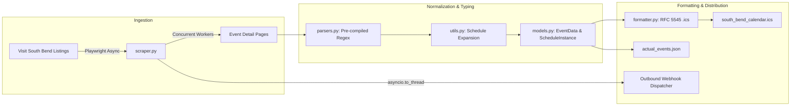

# South Bend Events Scraper V2: System Architecture & Design Document

**Document Version:** 1.1.0  
**Status:** Approved Baseline Architecture  
**Owner:** Brian / Antigravity  
**Last Updated:** September 9, 2026  

---

## Document Revision History

| Version | Date | Author | Description of Changes |
| :--- | :--- | :--- | :--- |
| **1.0.0** | 2026-09-02 | Brian & Antigravity | Initial baseline architecture established, documented in Obsidian Context Vault, and project tracking initialized. |
| **1.1.0** | 2026-09-09 | Brian & Antigravity | Refactored with strongly-typed data contracts (`models.py`), pre-compiled regex engine, `pathlib.Path` cross-platform paths, non-blocking async webhook dispatching, and CLI argument parsing. |

---

## 1. System Vision & Objectives

Asynchronous scraper, event normalization pipeline, and automated RFC 5545 iCalendar (`.ics`) generator for Visit South Bend regional events.

* **Repository Location:** `C:\Users\brian\Documents\Antigravity\AI Projects\SouthBendEventsScraperV2`
* **Master Vault Link:** `[[02-Projects/SouthBendEventsScraperV2/_index]]`
* **Target Tech Stack:** Python 3.11+, Playwright Async API, AsyncIO, iCalendar RFC 5545, GitHub Actions CI/CD / Cron

---

## 2. Architecture & Subsystems

### 2.1 Visit South Bend Ingestion Pipeline
* **Asynchronous Link Discovery**: Smooth auto-scroll with dynamic card rendering.
* **Controlled Concurrency**: Page processing throttled using `asyncio.Semaphore(MAX_CONCURRENT_REQUESTS)`.
* **Resilient DOM Selectors**: Cascading CSS queries for multi-format date/time headers and address lines.

### 2.2 Date/Time Parsing & Schedule Expansion
* **Pre-compiled $O(1)$ Regular Expressions**: Eliminates runtime recompilation overhead.
* **AM/PM & Range Inference**: Handles 12-hour/24-hour time ranges (e.g. `10:00 - 2:00 PM`), ordinal dates (`1st`, `2nd`), and year rollovers across December/January.
* **Recurrence Normalization**: Filters multi-day runs against explicit weekday patterns (e.g. `Wednesday - Sunday`).

### 2.3 iCalendar & Distribution Engine
* **RFC 5545 Serialization**: Deterministic SHA-256 event UIDs (`generate_uid`), full `VTIMEZONE` blocks, and exact line-folding at 75 octets.
* **Diff Engine & Webhook Notifications**: Computes newly added and removed events, dispatching non-blocking Discord/Slack/HTTP JSON payloads.

---

## 3. Production Tech Stack & Data Models

- **Runtime**: Python 3.11+
- **Browser Automation**: `playwright.async_api`
- **Typing Models**: `models.ScheduleInstance`, `models.EventData`, `models.DiffResult`
- **Paths**: `pathlib.Path`
